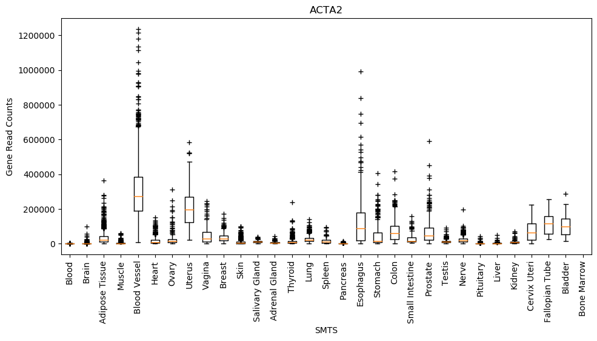

# parallel-arrays-profiling-and-benchmarking

Parallel Arrays, Profiling, and Benchmarking Traivs CI: [](https://travis-ci.com/cu-swe4s-fall-2019/parallel-arrays-profiling-and-benchmarking-tacaro)

# Required Data Files:

- <https://github.com/swe4s/lectures/blob/master/data_integration/gtex/GTEx_Analysis_2017-06-05_v8_RNASeQCv1.1.9_gene_reads.acmg_59.gct.gz?raw=true>
- <https://storage.googleapis.com/gtex_analysis_v8/annotations/GTEx_Analysis_v8_Annotations_SampleAttributesDS.txt>

# Usage

_plot_gtex_hash.py_ is the main component of this package. It is a python script that intakes GTEX RNA seq data and shows differential gene transcription patterns across various tissues.

_plot_gtex.py_ is a legacy version of this script that uses parallel arrays.

It requires:

- A GTEX Gene Reads file of the form: GTEx_Analysis_2017-06-05_v8_RNASeQCv1.1.9_gene_reads.acmg_59.gct.gz
- A GTEX sample attributes file of the form: GTEx_Analysis_v8_Annotations_SampleAttributesDS.txt

plot_gtex_hash.py requires the following arguments:

- --gene_reads (-gr): A GTEX Gene REads file, in file format .gz
- --sample_attributes (-sa): A GTEx sample attributes file, in .txt format
- --gene (-g): The desired gene to be searched
- --group_type (-gt): Either SMTS 'sample tissue' or SMTSD 'Tissue Group'
- --output_file (-o): desired name of plot to be generated, in .png format

plot_gtex.py is executed from the command line: `$ python plot_gtex.py --gene_reads GTEx_Analysis_2017-06-05_v8_RNASeQCv1.1.9_gene_reads.acmg_59.gct.gz --sample_attributes GTEx_Analysis_v8_Annotations_SampleAttributesDS.txt --gene ACTA2 --group_type SMTS --output_file ACTA2.png` This is the only script the user should execute. The included modules are referenced by plot_gtex.py.



# Benchmarking

`cProfile` was used to determine which functions of plot_gtex.py were the most time intensive: The most time-consuming function call was the linear search:

```
ncalls  tottime  percall  cumtime  percall filename:lineno(function)
    45904   19.509    0.000   19.514    0.000 plot_gtex.py:21(linear_search)
    29268    0.197    0.000    0.197    0.000 {method 'split' of 'str' objects}
```

When changed to a binary search, the speed increased dramatically:

```
ncalls  tottime  percall  cumtime  percall filename:lineno(function)
29268    0.160    0.000    0.160    0.000 {method 'split' of 'str' objects}
22951    0.104    0.000    0.106    0.000 plot_gtex.py:28(binary_search)
```

This is a speed increase by a factor of around 187X!

When changed from a parallel array binary search system to a hash table system, the speed increased dramatically:

```
ncalls  tottime  percall  cumtime  percall filename:lineno(function)
266    0.047    0.000    0.047    0.000 {built-in method marshal.loads}
38/37    0.042    0.001    0.045    0.001 {built-in method _imp.create_dynamic
1    0.035    0.035    0.035    0.035 {method 'dot' of 'numpy.ndarray' objects}
<many rows omitted from output>
1    0.000    0.000    0.003    0.003 plot_gtex_hash.py:80(main)
```

This is a speed increase of a factor of around 35X!

# Installation

1. pycodestyle is required to run the PEP8 adherence tests. This can be installed with `pip install pycodestyle`, upgraded with `pip install --upgrade pycodestyle` and uninstalled with `pip uninstall pycodestyle`.

2. Functional testing requires ssshtest, which can be installed with: `test -e ssshtest || wget -qhttps://raw.githubusercontent.com/ryanlayer/ssshtest/master/ssshtest . ssshtest`

3. Matplotlib is required for plotting, it can be installed with: `conda activate swe4s` `conda install matplotlib`

4. Pillow is required for image testing, it can be installed with `pip install Pillow`
